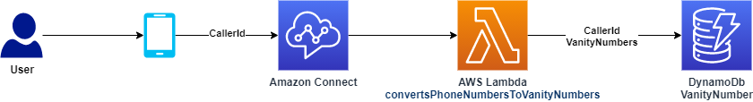

# MidLevelDevProject

## Deployment
1. [Deploy CDK Stack](https://github.com/jrwright121/MidLevelDevProject/tree/main/cdkStackforLambdaDynamoDb) - Lambda that converts phone numbers to vanity numbers and save the best 5 resulting vanity numbers and the caller's number in a DynamoDB table. 

2. [Deploy Connect Contact Flow](https://github.com/jrwright121/MidLevelDevProject/tree/main/connectContactFlow) - Amazon Connect contact flow that looks at the caller's phone number and says the 3 vanity possibilities that come back from the Lambda function 

## [Writing and Documentation](https://github.com/jrwright121/MidLevelDevProject/tree/main/writingDocumentation)
* Record your reasons for implementing the solution the way you did, struggles you faced and problems you overcame.
* What shortcuts did you take that would be a bad practice in production?
* What would you have done with more time?

## Test It Out!!! (216) 297-7866
Dial the number above to experience a working demo. 
