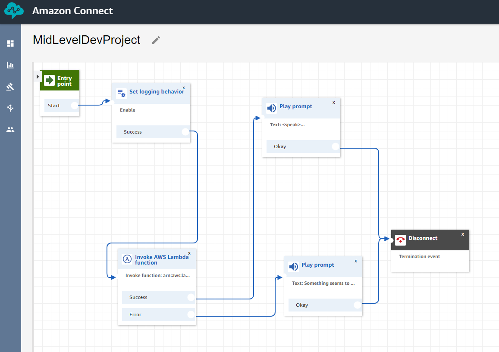
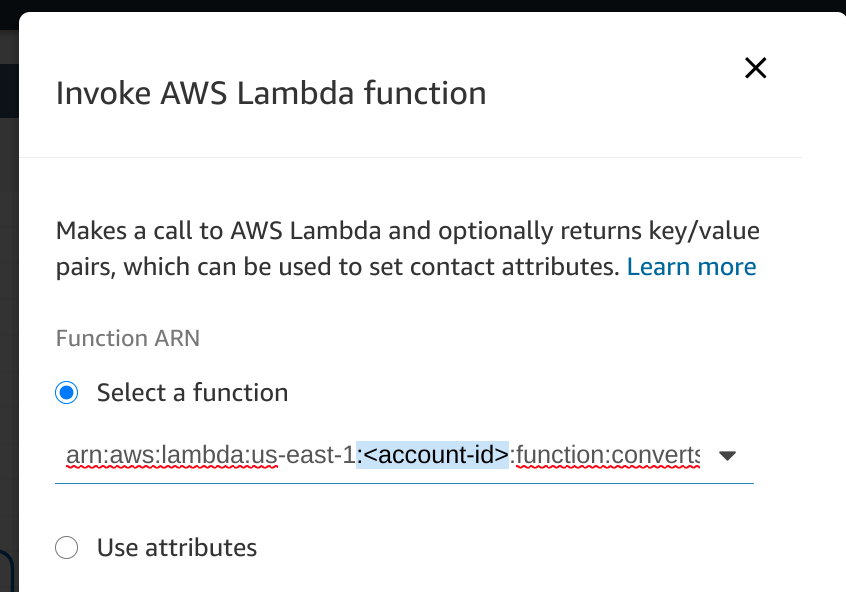

# Welcome to Voice Foundry Connect Contact Flow project: 
## MidLevelDevProject!

Amazon Connect contact flow that looks at the caller's phone number and says the 3 vanity possibilities that come back from the Lambda function

## Deployment
1. From Amazon Connect Account, click "Create contact flow"
2. Next to inactive save button click the dropdown and select "Import flow (beta)"
3. Click "Select" and from the file explorer choose "connectContactFlow/MidLevelDevProject"
4. Click "invoke AWSLambda function" node, and change the <account-id> to your own. 
5. Save and Publish Contact Flow. 
6. Progress back to AWS Console - Amazon Connect.
7. Select the Connect **Instance Alias** your Contact Flow is in.
8. Click "Contact flows" and from the AWS Lambda section **+Add Lambda Function**
